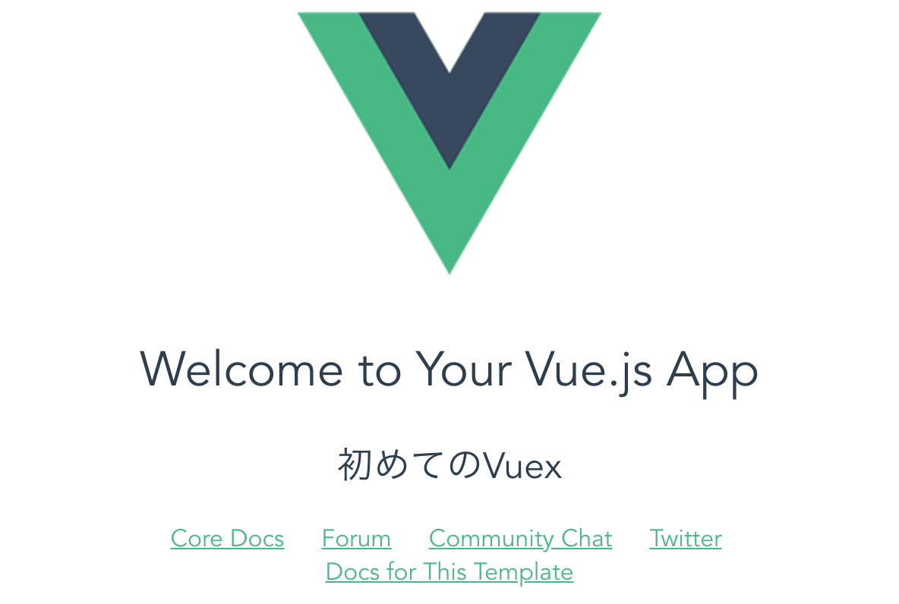

# first-veux

#### はじめに
vuexのはじめ方をVueCLIを使いながら行います．  
Macを想定して書いているため，Winユーザは適宜コマンド等を置き換えてください．

[Vue.js + Vuexで開発をしてみよう！](https://engineer.recruit-lifestyle.co.jp/techblog/2016-09-15-try-vue-flux/)のサイトを参考に作成しました．

以下の知識がない人はggrksです．

* HTML
* JavaScript
* npm
* vue

### VueCLIのインストール方法
Terminalにて，以下のコマンドを打ってください．  
rootでインストールしないとエラーが出て適切に実行されません．

```
$ sudo npm install -g vue-cli

```

### VueCLIを使う
Terminalにて，自分の作業フォルダに移動してください.その後，`vue`コマンドを実行しする．いくつか質問されますが，EnterでOKです．  
上のコマンドを実行すると，新しいフォルダが作成されます．

```
$ cd move/your/workspace
$ vue init webpack first_vuex
```
移動しましょう

```
$ cd first_vuex
```

ここで，以下のコマンドを実行すると，
`http://localhost:8080/`にアクセスすることができます．

```
$ npm run dev
```

これでVueの環境ができたことになります．

様々なフォルダ，ファイルが作成されているので，確認してみましょう！
一通り見たら次に進んでください．
特に見るべき場所は，

* App.vue
* main.js
* index.html
* components/HelloWorld.vue

### ちょっといじってみようか！
では，`src/components/HelloWorld.vue` を開いて，
上の方にある，`h2`タグの中身を変更して見ましょう．

```html
<template>
  <div class="hello">
    <h1>{{ msg }}</h1>
    <h2>はじめてのVuex</h2>
```
変更したら，以下のコマンドを実行して以下の画像のように，表示が変わるかどうかを見てみよう．
もし，上でこのコマンドを打ったままなら，自動的に表示が変わります．この状態を終わらせたかったら，`control`と`c`を同時押しでOK!  

_開発中はこのコマンドを実行したままで大丈夫です．_

```
$ npm run dev
```




では，次行ってみよう!

### Vuexを導入
Vuexの詳しいことは[Vuex公式](https://vuex.vuejs.org/)  をご覧下さい．  
以下のコマンドを実行して，Vuexを導入します．

 ```
 $ npm i -S vuex
 ```
 
#### 次に`store.js`を作成します．
Terminalにて操作するか，GUI操作にて`src/vuex/store.js`を作成してください．  
そこに，以下のように入力してください．

```js
import Vuex from 'vuex'
import Vue from 'vue'
Vue.use(Vuex)

const state = {}
const actions = {}
const getters = {}
const mutations = {}

export default new Vuex.Store({
  state,
  getters,
  actions,
  mutations
})
```
その後，`main.js`を変更します．

```js
import Vue from 'vue'
import App from './App'
import router from './router'
import store from './vuex/store.js' // 追加

Vue.config.productionTip = false

/* eslint-disable no-new */
new Vue({
  el: '#app',
  router,
  store, // 追加
  components: { App },
  template: '<App/>'
})
```

### Vuex体験
Vuexでは以下の４つで情報を回しています．


* Vue Components（アプリケーションの実体）
* Actions（ユーザの操作/APIとのやりとり）
* Mutations（状態への変更処理）
* State（状態，倉庫，記憶する場所）

そのため，それぞれについて記述をしなければいけません．ではStateから記述していきましょう．

#### Stateの記述
簡単に表現すると，情報を置いておく場所です．  
なにを保存するのかを記述しなければなりません．今回は`name`という名の情報を保存することにします．  
`store.js`の中身を変更してください．これにより，`name`を保存する場所を確保することができました．

```js
const state = {
  name: ''
}
```

#### mutation typeを作る
mutationとは，手続きや，操作といったことを指します．  

ここの説明は，ほぼ参考にしたサイトそのままになります.
> アプリケーション内でユーザーが行なうであろう操作について記述していきます。  
> いきなりActionsを作る前に、新しく、src/vuex/mutation-types.jsというファイルを作りましょう。
名前が示す通り、stateをmutate（変更）する操作のタイプを記述します。

`src/vuex/mutation-types.js`を作成して，以下のことを書いてください．

```js
export const CHANGE_NAME = 'CHANGE_NAME'  
```

> わざわざString型を同じ文字列の変数に代入して、さらにexportしていますね。
ユーザーの操作のタイプは、アプリケーション内のいたるところで参照するので、
変数にしておいたほうが使い勝手が良かったり、lintチェックの補助を受けられたりという利点があります。 

`store.js`にてこの宣言を呼びましょう.
`src/vuex/store.js`に以下の記述を追加した後，`action`のところに変更を加えてください．

```
import {
  CHANGE_NAME
} from './mutation-types'

:
:

const actions = {
  [CHANGE_NAME] ({ commit }, name) {
    commit(CHANGE_NAME, name)
  }
}
```
`commit`という言葉が使われていますね．これは，stateの中の情報を書き換えるといった処理になります．（実際は`mutations`が`state`に変更を加えています．次で`mutations`を記述します．）

### mutationsの記述
上で記述した通り，ここで`state`の中身に変更を加えます．  
`src/vuex/store.js`を変更してください．

```js
const mutations = {
  [CHANGE_NAME] (state, name) {
    state.name = name
  }
}
```

### getterの記述
`state`の中身をVue Componentsに渡す必要があるので，`getter`を変更しましょう．  
`src/vuex/store.js`を変更してください．
これは，`state`の中から，`name`という情報を渡すといったメソッドを記述しています．

```js
const getters = {
  getName: state => state.name
  /*
  getName: function (state) {
    return state.name
  }
  */
}
```

では，Vue Componentsを作成します．

### Vue Components作成
`src/components/Name.vue`を作成してください．  
そこに以下のように記述してください．  
これで，Vue Componentsを作成することができました．

```
<template>
  <div class="hoge">
    <input @change="CHANGE_NAME($event.target.value)" type="text">
    <div class="fuga">
      {{ getName }}
    </div>
  </div>
</template>

<script>
import { mapActions, mapGetters } from 'vuex'
import { CHANGE_NAME } from '../vuex/mutation-types'
export default {
  methods: {
    ...mapActions([
      CHANGE_NAME
    ])
  },
  computed: {
    ...mapGetters(['getName'])
  }
}
</script>
```

コンポーネントを作ったので，これを表示しましょう！  
簡単に表示するために，`src/components/HelloWorld.vue`を以下のように変更して見てください．場所の節約のため，上の方と，`script`タグの場所のみ載せています．他は変更しません．

```html
<template>
  <div class="hello">
    <h1>{{ msg }}</h1>
    <h2>初めてのVuex</h2>
    <Name></Name>
    
:
:

<script>
import Name from './Name'
export default {
  name: 'HelloWorld',
  data () {
    return {
      msg: 'Welcome to Your Vue.js App'
    }
  },
  components: {
    Name
  }
}
</script>
```

ここまでくると，ブラウザ上にテキストボックスが表示されるはずです．確認してください．  
テキストボックスに文字を入れてEnterキーを押すと下にその言葉が表示されます．

お疲れ様でした．

## せっかくなので，リアルタイムで入力した内容が変更されるようにしましょう!

上で行ったことは，テキストエリアに文字を入力して，Enterを押すと更新されるものでした．  
これでは物足りないので，リアルタイムで入力した内容が更新されるようにして見ましょう．  
vueでは`v-vind`を用いてこのようなことを行っていました．今回もそれに習ってやります．  

では，復習を兼ねて行いましょう!

### `src/vuex/mutation-types.js`に追記
まずは，どのような処理を行いたいかをここに追記しましょう．以下の内容を追記してください．
```js
export const REALTIME = 'REALTIME'
```

### `src/vuex/store.js`を変更 
まず，`state`の中身を変更して，どのような情報を登録するかを書きます．

```js
const state = {
  name: '',
  realtime: ''
}
```

そして，`action`を追加.

```js
const actions = {
  [CHANGE_NAME] ({ commit }, name) {
    commit(CHANGE_NAME, name)
  },
  [REALTIME] ({ commit }, name) {
    commit(REALTIME, name)
  }
}
```

`mutations`を変更します．

```
const mutations = {
  [CHANGE_NAME] (state, name) {
    state.name = name
  },
  [REALTIME] (state, name) {
    state.realtime = name
  }
}
```


これで`store.js`内は完了しました．今回は，v-vindを用いるので，getterは必要ありません．

### Vue Componentsを作成
次はVue Componentsを作っていきましょう．

`src/components/Name.vue`を以下の場所を変更してください.

```
<template>
  <div class="hoge">
    <input @change="CHANGE_NAME($event.target.value)" v-model="realtime" type="text">
    <div class="fuga">
      名前は = {{ getName }}
    </div>
    <div class="foo">
      リアルタイムは = {{ realtime }}
    </div>
  </div>
</template>

:
:

  computed: {
    ...mapGetters(['getName']),
    realtime: {
      get () {
        return this.$store.state.realtime
      },
      set (value) {
        this.$store.commit('REALTIME', value)
      }
    }
  }
```

`template`内の`input`タグに`v-vind`を追加した後，リアルタイムで入力した文字が更新されるところを追加しました．  
その後，`computed`内にメソッドを追加しました．`v-vind`を利用するためのものです．`get`と`set`をこのように記述すると`v-vind`を利用することができます．

これで変更する場所は終わりです．実際に確認して見てください．